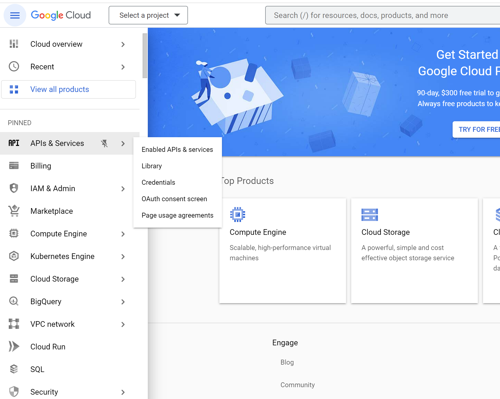
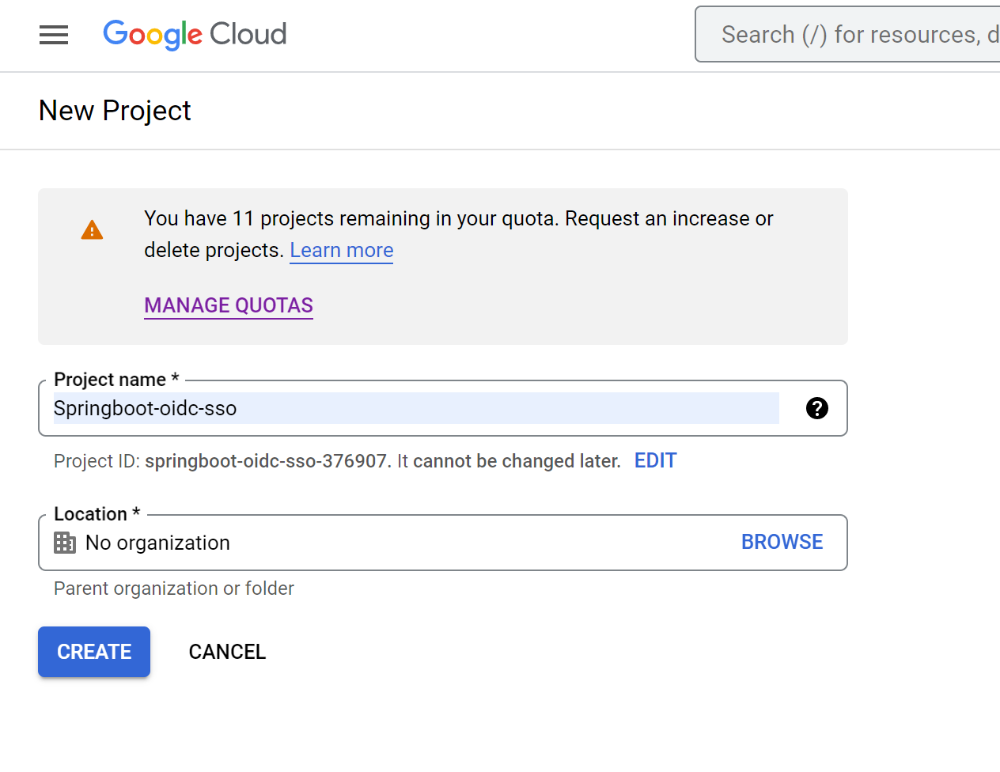
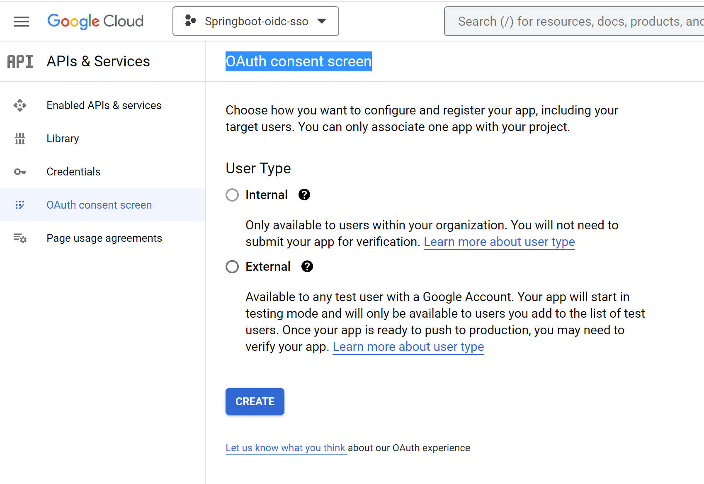
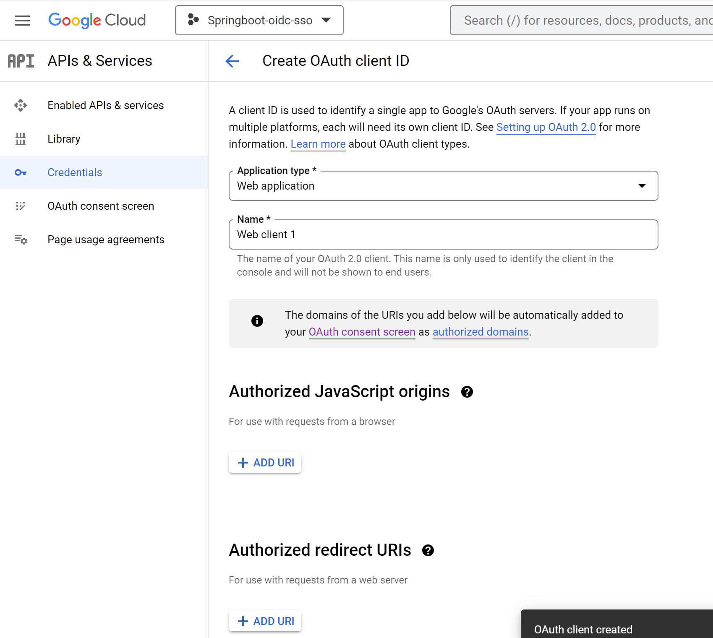
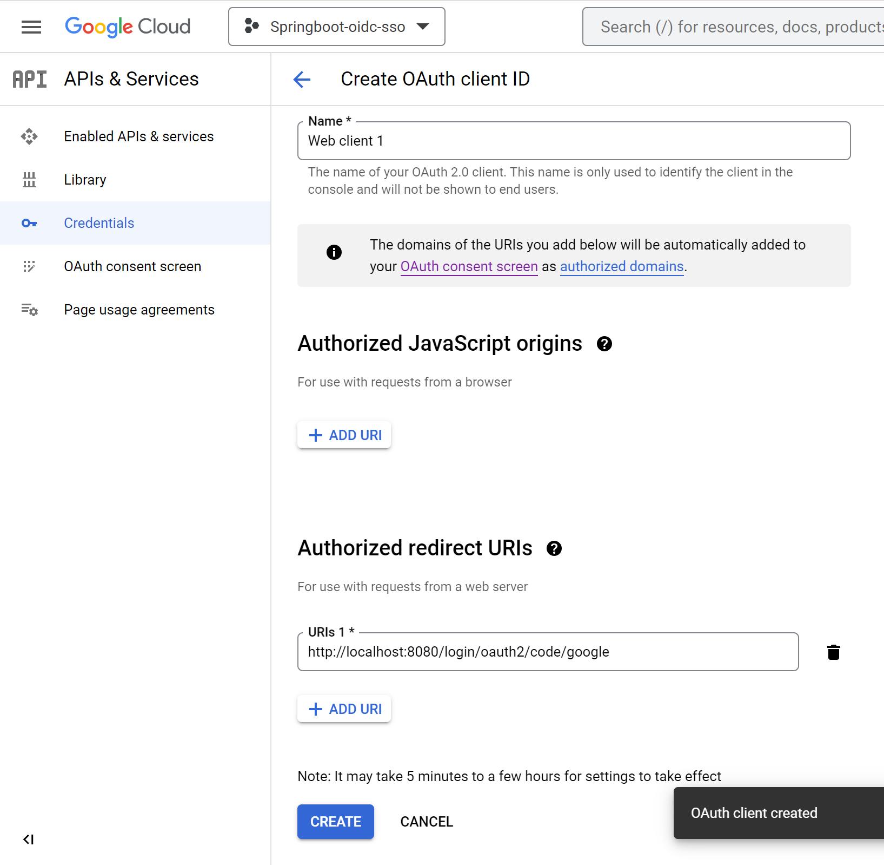
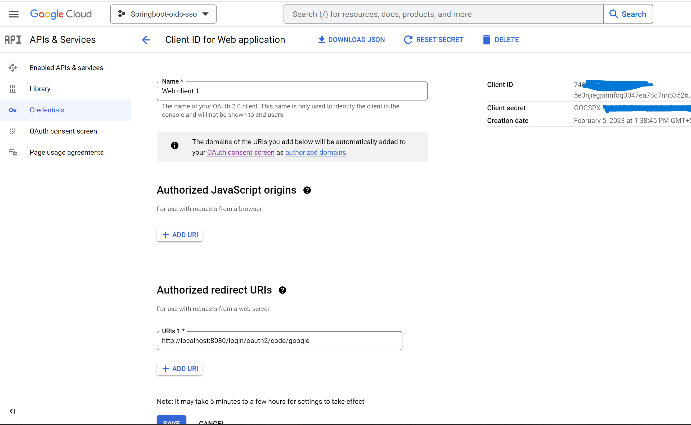

# SpringBoot project with OIDC based SSO implementation

## How to use it?

### Setup
- Import the project in your favorite IDE as maven project
- Review and configure `src/main/resources/application.yml` with the OIDC client id and secret details

#### Callback urls
http://localhost:8080/login/oauth2/code/github
http://localhost:8080/login/oauth2/code/google
http://localhost:8080/login/oauth2/code/gluu
http://localhost:8080/login/oauth2/code/azure

### Running the application
You can also build and run the process application with Spring Boot.

#### Manually
1. Build the application using:

```bash
mvn clean package
```
2. Run the *.jar file from the `target` directory using:

```bash
java -jar target/springboot-oidc-sso-0.0.1-SNAPSHOT.jar
```

For a faster 1-click (re-)deployment see the alternatives below.

#### Maven Spring Boot Plugin
1. Build and deploy the process application using:

```bash
mvn clean package spring-boot:run
```


## OIDC Provider configuration

### Google
Go to `console.cloud.google.com` --> Click `APIs & services` --> Click `Credentials`



- Click `Create Project`
- Name: springboot-oidc-sso
- Click `Create`



- Click `OAuth consent screen`
- Click `Create`



- Click `+ Create Credentials`
- Click `OAuth client ID`
- Select Application Type `Web application`



- Enter `Authorized redirect URIs` --> Click `Add URI`
- Redirect URI (optional): Web - http://localhost:8080/login/oauth2/code/google
- Click `Create`



- Click `OAuth web client` 



- copy `Client ID` and update in `application.yml` at `spring.security.oauth2.client.registration.google.client-id`
- Copy secret `Client secret` and update in `application.yml` at `spring.security.oauth2.client.registration.google.client-secret`

### Gluu


### GitHub
- GoTo `Settings` --> `Developer Settings` --> `OAuth Apps` --> click `New OAuth App`
- Set these values
```
Application name: springboot-oidc-sso
Homepage URL: http://localhost:8080
Authorization callback URL: http://localhost:8080/login/oauth2/code/github
```
- Click `Create Application`
- Take `Client ID` and update it in `application.yml` at `spring.security.oauth2.client.registration.github.client-id` 
- Click `Generate a new client secret`
- Copy the secret and update it in `application.yml` at `spring.security.oauth2.client.registration.github.client-secret`
- Click `Update Application`
- (Re)Start the SpringBoot application

When you(the user) login first time you will see the authorization screen like below...


Once authorized, the application logged in and it has the user information.
Read the logs to understand the call exchanges

GitHub will send email about the authorization like below


### Azure
Go to `portal.azure.com` --> `Azure Active Directory` --> `App registrations` --> `New registration` --> 
#### App registration


- Register the application
```
Name: springboot-oidc-sso
Redirect URI (optional): Web - http://localhost:8080/login/oauth2/code/azure
```
- Click `Register`


- copy `Application (client) ID` and update in `application.yml` at `spring.security.oauth2.client.registration.azure.client-id`

- Click `Add a certificate or secret`
- Click `New Client Secret`
- Give a description and choose an expiration period.
- click `Add`
- Copy secret `value` and update in `application.yml` at `spring.security.oauth2.client.registration.azure.client-secret`
- Go to application


Click `Endpoints`, copy the value of `OpenID Connect metadata document` and update it in `application.yml` at `spring.security.oauth2.client.provider.azure.issuer-uri`


Take the client ID and Secret from the application details page


When you(the user) login first time you will see the authorization screen like below...


- Add client credentials to generate secret.

- (Re)Start the SpringBoot application


### Experience it
The default redirect URI template is {baseUrl}/login/oauth2/code/{registrationId}

http://localhost:8080/

## References
https://spring.io/guides/tutorials/spring-boot-oauth2/


